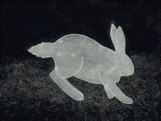
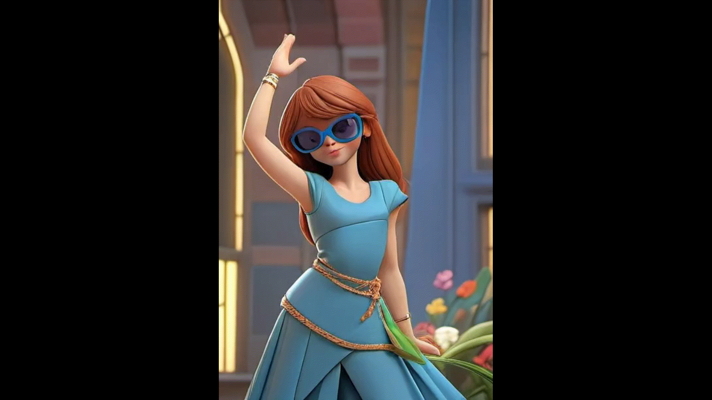

[](https://colab.research.google.com/drive/1lShjBqJdRxSm9wVu-BgCKepYQb9V2fTy?usp=sharing) [](https://www.kaggle.com/pogscafe/hotshot-xl)

# Examples

```
python inference.py \
  --prompt="van gogh painting of a bunny rabbit running, side view, black eyes, octane render, grass, flowers, dramatic lighting, pixar style, nature, enchanting, wonderfully colored, vibrant, cute" \
  --negative_prompt="blurry, fog" --steps=30  --seed=2913947611431714917  \
    --width=608 --height=416 --video_length=8 --video_duration=1000  \
    --scheduler="EulerAncestralDiscreteScheduler" --lora="lora/vangogh.safetensors" \
    --gif="input/bunFF.GIF" --control_type=depth  \
    --controlnet_conditioning_scale=0.8  --control_guidance_start=0.0 --control_guidance_end=1.0 \
    --output="output/1015bun_20231015-191837.mp4"
```

LoRA: [vangogh.safetensors](https://civitai.com/models/157780/vangoghbrushwork-sd-xl-10)

| Input | Output |
|-----------|----------|
|  |  |  

-----------

```
python inference.py \
  --prompt="gorgeous girl, princess dancing, slight smile, 1girl, wearing colorful blue opaque sunglasses, long brown hair, thick bangs, blue dress, dancing in a futuristic castle, octane render, flowers, dramatic lighting, highres, enchanting, wonderfully colored, cinematic, vibrant" \
  --negative_prompt="blurry, fog, teeth, eyes" \
  --steps=30 \
  --seed=3058248663247638579  \
  --width=416 --height=608 --video_length=8 --video_duration=1000 \
  --scheduler="EulerAncestralDiscreteScheduler" \
  --lora="lora/samaritan.safetensors" \
  --gif="input/dancer1.GIF" \
  --control_type=depth  --controlnet_conditioning_scale=0.8  --control_guidance_start=0.0  --control_guidance_end=1.0 \
  --output="output/1015castle_20231015-175145.mp4"
```

LoRA: [samaritan.safetensors](https://civitai.com/models/121932?modelVersionId=132727)

| Input | Output |
|-----------|----------|
|  |  |  

-----------

```
python inference.py \
  --prompt="candle on a desk in an alchemist lab, alchemy lab, books, vial with green liquid, colorful gems, decorative skull, still camera, still shot of a burning candle" \
  --negative_prompt="blurry, fog"  --steps=40  --seed=12240062779010287701 \
  --width=672  --height=384  --video_length=8  --video_duration=1000 \
  --scheduler="EulerDiscreteScheduler"  --output="output/witchc_20231012-002505.mp4"
```
 

-----------

```
python inference.py \
  --prompt="cinematic close-up photograph gorgeous girl wearing a white VR headset sitting next to a lake at night,  undercut hair, dark brown hair in a ponytail, undercut hairstyle, brown lipstick, beautiful full lips, slight smile, long white maxi dress, tight waist, lush water, wonderfully colored, surrounded by alien plants, grass, spring flowers, trees,"    --negative_prompt="deformed, blurry, nodding"    --steps=30    --seed=12063574224606089507    --width=672    --height=384    --video_length=8    --video_duration=1000    --scheduler="EulerAncestralDiscreteScheduler"    --upscale=2 --output="output/out_20231016-042936.mp4"
```
[vr.webm](https://github.com/wandaweb/Hotshot-XL/assets/63283384/182804d9-b720-4343-833f-9fe43599dd2f)

-----------

```
python inference.py \
  --prompt="lightning frog made of green lightning alone in a dark cyberpunk street, centered, still camera, beauty and aesthetics, thunder, composed of elements of thunder, thunder, electricity, glowing, glowing eyes, green theme" \
  --negative_prompt="blurry, fog"    --steps=40    --seed=5160677974417066473 \
  --width=672    --height=384    --video_length=8    --video_duration=1000 \
  --scheduler="EulerDiscreteScheduler"    --lora="lora/thunder.safetensors"  --output="output/witchc_20231012-025908.mp4"
```
LoRA: [thunder.safetensors](https://civitai.com/models/152849?modelVersionId=171103)

[for.webm](https://github.com/wandaweb/Hotshot-XL/assets/63283384/1f2a7e9a-9d34-4ace-829e-6ef7a7b1ccba)

-----------

```
python inference.py \
  --prompt="gargoyle with glowing green eyes in a dark cyberpunk street, centered, still camera, beauty and aesthetics, thunder, composed of elements of thunder, thunder, electricity, glowing, glowing eyes, green theme"    --negative_prompt="blurry, fog"    --steps=40    --seed=325960011305489001    --width=672    --height=384    --video_length=8    --video_duration=1000    --scheduler="EulerDiscreteScheduler"    --lora="lora/thunder.safetensors"  --output="output/witchc_20231012-032322.mp4"
```
LoRA: [thunder.safetensors](https://civitai.com/models/152849?modelVersionId=171103)

[gargoyle.webm](https://github.com/wandaweb/Hotshot-XL/assets/63283384/04b8520e-4dc7-4364-8588-d03c9bbfefea)

-----------

```
python inference.py \
  --prompt="evil cyborg with green glowing eyes walking in a cyberpunk city, composed of elements of thunder, octane render, dark cyberpunk street, apocalyptic, wrecked cars, dramatic lighting, cinematic, synthwave, slow motion"    --negative_prompt="blurry, fog, fast, fast paced"    --steps=40    --seed=7820040852926985075    --width=672    --height=384    --video_length=8    --video_duration=1000    --scheduler="EulerDiscreteScheduler"     --lora="lora/thunder.safetensors" --output="output/cyb_20231012-171259.mp4"
```
LoRA: [thunder.safetensors](https://civitai.com/models/152849?modelVersionId=171103)

[cyborg.webm](https://github.com/wandaweb/Hotshot-XL/assets/63283384/b9213d75-61a2-4c5f-9ca2-e280510446e5)

-----------

```
python inference.py \
  --prompt="zombies dancing in a cyberpunk city, dark cyberpunk street, apocalyptic, torn clothes, derelict buildings, wrecked cars, dramatic lighting, cinematic, wonderfully colored, synthwave, slow motion"    --negative_prompt="blurry"    --steps=40    --seed=2285057174583360523    --width=672    --height=384    --video_length=8    --video_duration=1000    --scheduler="EulerDiscreteScheduler"    --output="output/out_20231012-042606.mp4"
```

[zombi.webm](https://github.com/wandaweb/Hotshot-XL/assets/63283384/81201ce6-39c5-4c0f-b465-bbdb2eb582dc)

